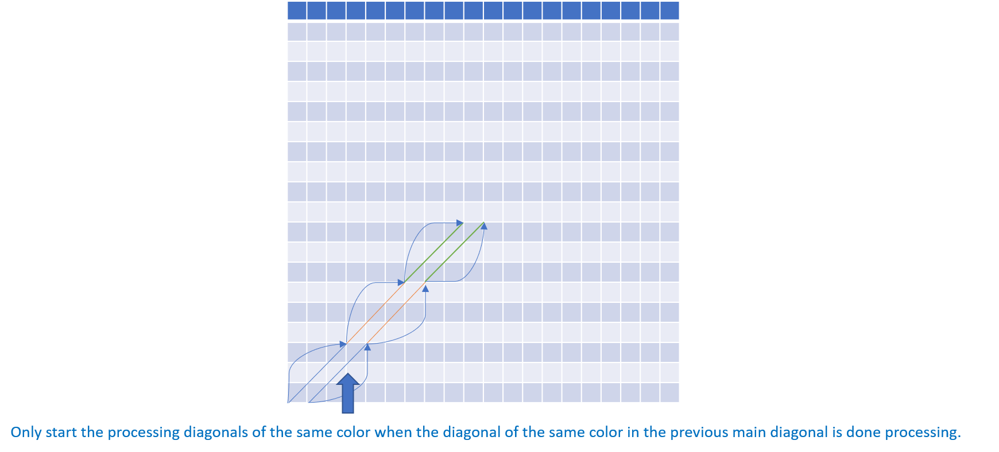
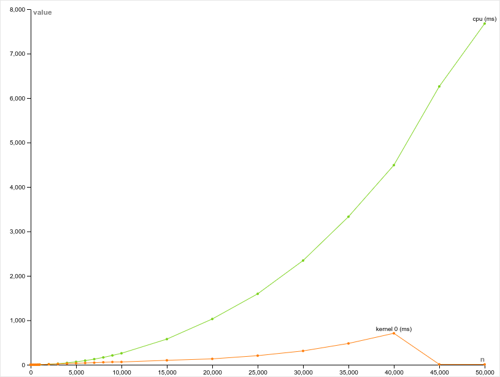
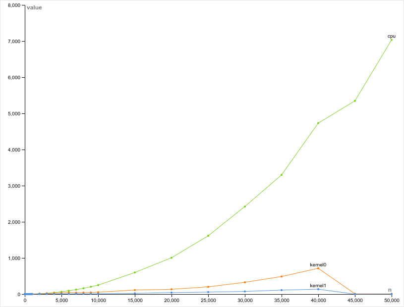

# Overview

This code implements the Needleman-Wunsch algorithm for exact string matching.

# Instructions

To compile:

```
make
```

To run:

```
./nw [flags]

```

Optional flags:

```
  -N <N>    specified the size of the strings to match

  -0        run GPU version 0
  -1        run GPU version 1
  -2        run GPU version 2
  -3        run GPU version 3
            NOTE: It is okay to specify multiple different GPU versions in the
                  same run. By default, only the CPU version is run.
```

To run in a loop (only works for cpu now):

```
> chmod +x nw-loop.sh // only the first time
> ./nw-loop.sh
```

## The Global Alignment Problem, and the Needleman-Wunsch Algorithm:

Before talking about the Needleman-Wunsch Algorithm, we must introduce the problem it tries to solve.

In Biology, information is very often represented in the form of strands or sequences of molecules. Here are couple of examples:

#### ***DNA:*** 

The study of DNA is called genetics. It is the most basic storage medium of genetic information in all eukaryotes as well as a lot prokaryotes. DNA is sequenced in a long strand of nucleotides that encode the instructions required to produce every protein that constitutes a living being. There are four nucleatides, and are denominated by the letters A, T, C & G. They are basically molecules that can bind together to form the double stranded shape of DNA. 

DNA can be thought of as a global, unique identifier that specifies the person you are. How similar two strands of DNA, tells us the relationships between two living beings or species. For example, twins will have an extremely similar DNA sequence. Brothers and sister, less so, humans and mokeys even less so. What is interesting about this, is that this common and global store of information can be to study the evolution of biological systems. By studying the similarities and differences between two of those strands, we establish how closely related two biolgical enitites are. From this we can produce many useful analyses, for example, two viruses that have a very similar DNA sequence might be cured by the very same medicine. 

#### ***Proteins:***

Proteins could be said to be one of the most important building block of any biological system. Every protein is built from molecules called amino acids. There are 20 of them in total. What is important to know about proteins is that is not their content, but their 3D geometry that determines their function. It is therefore, a very interesting problem to be able to determine the geometry of a protein. This shape is called a protein's fold, and is generally described by three interconnected structures. First, there is the primary structure which consists of the sequence of amino acids. Next, there is the secondary structure which is specified by the hydrogen bonds that form between these amino acids, forming shapes like alpha-helixes, and beta-sheets. Then, there is the tertiary structure that that arises from the combination of the previous folds and random interactions between the elements of the primary and secondary structures. 

What is interesting about what was said previously is that the tertiary structure of a protein (its 3D geometry), is entirely determined by its primary structure (the strand of amino acids). Therefore, an important question arises: given a random string of amino acids, are you able to predict the 3D shape that a protein will take? This has been shown to be an NP-Complete problem. As such, we cannot, yet, predict the shape of any protein fast enough from a given strand of amino acids. However, what we know, is that very similar protein strands might fold similarly locally. Therefore, if you know how a particular strand folds, you maybe could use this information to make general predictions or guesses about how another similar strand might generally fold (However, this method usually fails in practice).

#### ***The Global Alignment Problem:***

However, we are computer scientists, we prefer thinking of things in terms of data structures and algorithms. What does all of this sounds like to us? Well, a strand of only four possible characters sounds like a string or an array of base 4 numbers. Similarly, a strand of 20 possible characters, sounds like a string or array of base 20 characters. If the biologists were to give us the comparison criterias, we might be able to determine a very fast way of comparing these strings. We could therefore, analyse a large amount of data, extracting value from it. As it happens to be, this problem is called the alignment problem.

There are two types of alignment methods, local alignment and global alignment. In our case, we are interested in global alignment. This method is very useful when comparing two very similar strands. This problem states, given two strings, align the elements between each of those strings such that moving any element in any string would result in a lower or equal match rate. You are allowed to add spaces between two elements in the two strings to get a better match. In biology, theses spaces might be interesting to analyse mutations that could have arisen, they are alled indel. As we can see this problem is very similar, to a problem we know all too well in computer science, and that is the Longest Common Sub-sequence (LCS).

In a more particular way, we are interested in the Needleman-Wunsch Algorithm. This algorithm solves the issue of global alignment by implementing a scoring system for the match rate, using a dynamic programming approach that is quite similar to the LCS Problem. As we know, dynamic programming requires two preliminary conditions about a problem to be fullfiled in order work. These conditions are optimal substructure, and overlapping sub-problems. So, how are, in our case, these requirements met?

* <ins>Optimal Sub-Stucture</ins>:

In our problem, optimal sub-structure presents itself as follows: If I know the optimal solution of a sequence of two strings, then I know that by adding one new character to each string, there are three possible solutions to the optimal alignment of the newly formed strings. The first, is inserting a gap in the first string and adding the new character for the second string, the second option is adding the new character for the first string and a gap in the second string, and the third is inserting the new character for both strings, as is, may it be a match or a mismatch. To decide which option to choose, we rely on a basic scoring system. What this does, is assign a grade to each possible eventuality based on a pre-determined schema. In practice it is common to assign a grade of -1 to any gap or mismatch, and a grade of 1 to a match. When the grades are assigned, the best match is the one that has the highest grade.

* <ins>Overlapping Sub-Problems and Memoization:</ins>:

In our problem, we can show that given two strings of characters, it is possible to determine the best global alignment by deconstructing the problem into simpler sub-problems. As was shown previously, we can determine an optimal solution for the addition of one character to an already optimal sequence alignment. Therefore, by scanning sequences one by one, we can divide the problem into simpler sub-problems that are essantially the same as solving the optimal sub-structure problem. In our case, the optimal alignment can be determined by a memoization step that saves the grade of the current optimal solution into an array, by calculating it from the grade assigned to each possible solution to a previous sub-problem. Since the problems are decreasing in size until the two sub-strings reach a length of 0, the algorithm terminates correctly, filling an array of scores for each sub-sequence. Finally, a traceback step is required to extract the best global alignment from the array.  

What makes the Needleman-Wunsch Algorithm different from the LCS dynamic algorithm, is the traceback step. In fact, to fill the matrix we use the exact same steps.

However, in our case we are not interested in the traceback algorithm as we will concentrate on determining the grade of each sub-problem, and the filling of the memoization matrix.

## Parallelization Attempts:

### Attempt 1:

Our first parralelisation attempt consists of assigning threads whithin blocks in a diagonal manner. The reason we chose this approach, is that given a position to compute (i, j), we cannot start the computation of this cell berfore computing the values of the neighbors (i-1, j-1), (i-1, j), (i, j-1). If we were to go with the traditional approach of assigning threads to the matrix indices, we would end up with the problem of computing cells that do not have computed neighbors. However, assigning threads diagonally, we notice that every cell has its computational requirements ready before its computation. As a general guideline of how we plan to execute this method, please have a look at the following diagram:


In it, you can see that accross the same reversed diagonal iteration, the cells that are cut by the line, execute in parallel having their computed resources already computed by the previous diagonal block. As such, using one kernel we are able to iterate over all the block's cells in a way that makes parallelisation obviously apparent. In the following image, you can see another way of representing the parallel pattern that we are trying to achieve:


However, the problem does not end here. Given the previous method of computing blocks, it is clear that while they are easily parallelizable, there is a synchronicity problem between different executing blocks. Take the following as example:


In this example consider this matrix as the output matrix, and not as a block. As you can see, the green blocks require values that are produced by the yellow block. However, if we run the kernel on all blocks at the same time, there will be a racing condition in the equivalent positions of (-2, -1), (-1, -2) & (-2, -2), potentially rendering the values in the green blocks completely wrong. As such, we must synchronize, one way or another the execution of the blocks. To do this, as a first attempt, we choose to implement this synchronisation using the CPU. After executing a number of specified blocks, the GPU will have updated the global memory output array, it is at this point that the CPU will order a new execution of the kernel on a specified input set.

In summary, we have proposed a parallelisation plan for the matrix filling part of the Needleman-Wunsch Algorithm. It uses diagonal threads to compute the scores of indivual cells within blocks, and syncronize between each other, with help of the CPU to produce the correct output matrix.

We think that this attempt was very successful. At some point during, development, we realised that without intending to do so, we had already applied a partial optimisation. We ran the code using 2D blocks applying a kind of thread coarsening along with some memory coalescing (We're saying partial as we have not studied the behavior of using smaller or larger blocks). However, we think there is a lot of work left. We can extract even more performance from this problem. For now, we will concentrate on adding shared memory to the kernel as we think that it will bring the greatest benefit. Using it, we can actually achieve readings and writings to memory in coalesced way. Furthuremore, we may benefit from shared memory even more by effectively having full memory reuse, on the three accesses that we have on each thread. Right now, we need to go to back to global memory each time we access an element, and our reads are not necessarily coalesced.

### Attempt 2:

As mentioned in the previous iteration, we had applied some kind of optimization without realizing it. It consisted of a kind of thread coarsening where we would group diagonals into blocks and iterate over them in the same block. This time, we had decided to implement an optimization related to shared memory. Instead of letting each thread load the value it needs from global memory, we will first load the values into a 2D array in shared memory. Using this technique, we are able to alleviate inefficiencies in two ways: 

The primary reason we decided to implement this optimization, is that we will be able to achieve a higher memory reuse. Previously, we read from global memory three times, once to get a value from the top, once to get a value from the left, and once to get a value from the top-left. Each of those accesses required us to go back to global memory in order to read a value that was already processed. Now, we are writing the result of each of our operations back to the shared memory array in the hope of reusing each of the values three times.
Second, we are now able to read and write to global memory in a coalesced way. Indeed, using a shared memory array, we can now load values row by row, taking advantage of memory bursts in order to perform IO operations much faster.
To perform this optimization, we had to reduce our block size from 1024 to 32 as the maximum amount of shared memory on the GPU being used is 64 KB (NVIDIA RTX 2080). However, this change turned out to be a good thing as even without implementing the algorithm, we noticed a performance improvement using a lower amount of thread coarsening.

For the next iteration, we are finally planning to implement thread coarsening as an optimization. Clearly, it has played a role in our previous implementations. However, we are now ready to study its behavior in a more defined way. To achieve this we will increase the block size we are processing without increasing the number of threads we are using. The problem we will therefore face, is how to process process a block where diagonals within a block are not of an equal size as one side of this block. To do this, we will break up diagonals into segments of the same-length and iterate over them achieving a higher. Of course, we will have to find a way to reuse the shared memory matrix for different iterations on the segment.

Also, we have noticed that we are not maximizing our occupancy, and will therefore try to address this problem in the next iteration. One potential solution, is to launch a grid with many more threads than a single diagonal can support. However, we only use the extra-threads when we are finished processing the previous diagonal segment.



## Code Description:

### The Needleman-Wunsch Algorithm on the CPU:

The Needleman-Wunsch algorithm requires us to fill an array with sequences of scores in order to determine the correct global alignment between two strings of characters.

```C++
 1    void nw_cpu(unsigned char* reference, unsigned char* query, int* matrix, unsigned int N) {
 2        for(int q = 0; q < N; ++q) {
 3            for (int r = 0; r < N; ++r) {
 4                // Get neighbors
 5                int top     = (q == 0)?((r + 1)*DELETION):(matrix[(q - 1)*N + r]);
 6                int left    = (r == 0)?((q + 1)*INSERTION):(matrix[q*N + (r - 1)]);
 7                int topleft = (q == 0)?(r*DELETION):((r == 0)?(q*INSERTION):(matrix[(q - 1)*N + (r - 1)]));
 8                // Find scores based on neighbors
 9                int insertion = top + INSERTION;
10                int deletion  = left + DELETION;
11                int match     = topleft + ((query[q] == reference[r])?MATCH:MISMATCH);
12                // Select best score
13                int max = (insertion > deletion)?insertion:deletion;
14                max = (match > max)?match:max;
15                matrix[q*N + r] = max;
16            }
17        }
18    }
```

It starts by looping over the two strands on line 2 and 3. 

#### ***Extracting the values of the neighbors:***

During each iteration, the algorithm first needs to get the values of its neighbors in the matrix, specifically the value above (line 5), to the left (line 6), and to the upper left diagonal (line 7), relative to the current value. For each value that needs to be extracted here is the procedure:

* <ins>top:</ins> If the current index in the query string is at position 0, then the value that needs to be extracted is the previous reference index plus 1 times -1. Otherwise, take the value of the matrix from the position above.

* <ins>left:</ins> If the current index in the reference string is at position 0, then the value that needs to be extracted is the previous query index plus 1 times -1. Otherwise, take the value of the matrix from the position left to current value.

* <ins>topleft:</ins> If the current index in the query string is at position 0, then the value that needs to be extracted is the previous reference index plus 1 times -1. Otherwise, if the current index in the reference string is at position 0, then the value that needs to be extracted is the previous query index plus 1 times -1. Otherwise, take the value of the matrix from the position upper-left diagonal to current value.

#### ***Assigning a score to each possible alignment case:***

After that, we need to assign a score to each possible entry in the current position of the matrix. There are four such possibilities: An insertion (line 9), a deletion (line 10), a match (line 11), and a mismatch (line 11).

* <ins>Insertion</ins>: An insertion represents the fact that a gap needs to be inserted to get a better global alignment. Its score is computed by adding the top value to the score of an insertion (-1 in our case).

* <ins>Deletion:</ins> A Deletion also represents the fact that a gap needs to be inserted in order to get a better global alignment. Its score is computed by adding the top value to the score of a deletion (-1 in our case).

* <ins>Match & Mismatch:</ins> A match or a mismatch represents the fact that current position in reference string may contain or not the same value as the query string. The score in this case is computed in the following way: Add the topleft value to the evaluation of the following expression ( If the value contained at the current position in the query string is equal to the value contained at the current position in the reference string, then return a score of a match (+1) else return the score of a mismatch (-1) )

#### ***Comparing the resulting scores:***

Finally, we need to evaluate the best possibility for the alignment at this position (lines 13 & 14). We do that by comparing the scores we computed previously for the insertion, deletion, match, and mismatch.

* <ins>Max of insert and delete:</ins> First we compare the insertion score to the deletion score (line 13), and take the maximum between them.

* <ins>Max of match and previous max:</ins> Then we compare the result of the match scoring (can also represent a mismatch in our case) to the result of the max operation done previously (line 14), and take the maximum between them.

In the end we save the result of the previous operation into the output array (line 15).

### The Needleman-Wunsch Algorithm on the GPU:

As you can see, the Needleman-Wunsch Algorithm on the GPU presents itself, in two parts. 
First, there is a driver function `nw_gpu0` that runs on the CPU, and then, there is `nw_kernel` that runs on the gpu.

```C++
 1  __global__ void nw_kernel0(unsigned char* reference, unsigned char* query, int* matrix, unsigned int N, int iteration_number) {
 2
 3
 4        // Transform 1D Grid Coordinates into 2D Diagonal Coordinates.
 5        int diagonal_block_row = blockIdx.x;
 6        int diagonal_block_col = iteration_number - diagonal_block_row;
 7  
 8        if( iteration_number > gridDim.x) {
 9            diagonal_block_row = ( (N + BLOCK_SIZE - 1)/BLOCK_SIZE ) - blockIdx.x - 1;
10            diagonal_block_col = iteration_number - diagonal_block_row;
11        }
12  
13        for( int diagonal = 0; diagonal < 2*BLOCK_SIZE; diagonal++ ) {
14
15            int thread_limit = (diagonal < BLOCK_SIZE) ? (diagonal) : (2*BLOCK_SIZE-diagonal);
16  
17            // Verify that the diagonal thread index does not exceed the maximum number of elements allowed by the diagonal at this iteration.
18            if( threadIdx.x <= thread_limit ) {
10
20                // Get the position of the thread inside the block.
21                int pos_in_block_x = threadIdx.x;
22                int pos_in_block_y = diagonal - pos_in_block_x;
23  
24                if( diagonal > BLOCK_SIZE ) {
25                    pos_in_block_x = BLOCK_SIZE - threadIdx.x - 1;
26                    pos_in_block_y = diagonal - pos_in_block_x - 1;
27                }
28  
29                // Calculate the positions of the thread inside the matrix.
30                int mat_row = diagonal_block_row * blockDim.x + pos_in_block_y;
31                int mat_col = diagonal_block_col * blockDim.x + pos_in_block_x;
32
33                if( mat_row < N && mat_col < N ) {
34
.
.				  	  // Same code as the Needleman-Wunsch Algorithm
.
63                    // Update the matrix at the correct position
64                    matrix[  mat_row*N + mat_col ] = max;
65
66                }
67            }
68
69            __syncthreads();
70
71        }
72
73    }
74
75
76    void nw_gpu0(unsigned char* reference_d, unsigned char* query_d, int* matrix_d, unsigned int N) { 
77
78        unsigned int numThreadsPerBlock = BLOCK_SIZE;
79
80        for(int iter=0; iter < 2* ( (N + BLOCK_SIZE - 1) / BLOCK_SIZE) - 1; iter++) {
81  
82            // Configure next run
83            unsigned int numBlocks = (iter < (N + BLOCK_SIZE - 1) / BLOCK_SIZE) ? (iter + 1) : (2*((N + BLOCK_SIZE - 1) / BLOCK_SIZE) - iter - 1);
84  
85            //printf("%d, %d\n", iter, numBlocks);
86            // Launch kernel
87            nw_kernel0<<<numBlocks, numThreadsPerBlock>>>(reference_d, query_d, matrix_d, N, iter);
88  
89            cudaDeviceSynchronize();
90  
91        }
92  
93    }
```

#### nw_gpu0:

At line 80 we start a loop that iterates 2\*ceil(N/BLOCK_SIZE) - 1 times. The reason we iterate this exact number of times, is that we need 1 kernel call per block diagonal, and
as it happens to be, an NxN matrix has 2\*N-1 reverse diagonals.
For example, take the following image, and assume that the block size is 2.


As you can probably see that there are 7 different colors. Each color represents one block diagonal that we need to iterate through.

During each iteration we do the following:

1. Calculate the required number of blocks for the current iteration (line 83).
2. Call the kernel with the correct parameters (line 87).
3. Call cudaDeviceSynchronize to make sure that the next iteration can start, if and only if, the GPU has finished computing the current iteration (line 89).

Note: The diagonal size starts decreasing after iteration N, so we adjust for this with the conditional statement on line 83.

In conclusion, the job of `nw_gpu0` is to control and synchronise kernel calls so that the required values by the next diagonal are computed and prepared during the current iteration, slowly building up the ouput matrix block diagonal by block diagonal.

#### nw_kernel0:

The `nw_kernel0` kernel has many aspects that makes it a little bit unintuitive, and that is, that threads and blocks run diagonally to the output matrix.
This causes the calculation of positions in the matrix to be a little bit more awakward.
However, what it essantially does can be broken down into two parts:

1. Calculate the position of the executing block in the output matrix (line 4 - 11):

The first bit of confusing code, is at line 5 and 6.

What we are trying to do is to find the x-coordinate, and the y-coordinate of the executing block in the matrix.
However, the only information that we know about the currently executing block is its position in the grid (the grid index), and the iteration it is a part of.

From this information, we can extract the following:

We know that the diagonal we are speaking of is a revesed diagonal. We can, therefore, represent the different positions that this diagonal pass through using the following formula: `x + y = iteration`. Since we know that the index of blocks in the grid directly map directly its y-position in the grid, we can determine the x-position of the block in the ouput matrix using the following formula: `x = iteration - y`

Note: What helped me grasp how we should find the position of the block in the matrix was to relate it to linear algebra. The explanation above is equivalent to a linear transformation of a 1D vector in the grid into a 2D vector in the matrix.


Then at line 8, we verify that the diagonal based on which we are calculating the block position in the ouput matrix, does not exceed N. If it does then the calculation the position of the block changes a little bit as the size of the diagonals are now decreasing.

2. Loop over each diagonal in the block (line 13-71):

We start looping over all the reversed diagonal within the currently executing block. 

We calculate an upper bound for the thread index for each iteration of the loop (line 15) and then only let threads passthorugh if they are within this upper-bound (line 18).

In the same way that we calculated the position of x and y for the block in the matrix, we calculate the position x and y of threads within this block based on the diagonals (line 21 & 22). We also do a verfication for the diagonal size as we did for the blocks (line 24), and update the positions of the threads accordingly.

Finally, we can calculate the threads x and y coordinates within the ouput matrix (line 30 & 31).

From there, it is smooth sailing, we first do a boundary check on the coordinates we obtained to make sure that threads beyond N do not execute (line 33). Then from line 34 to 64, we apply the exact same computational steps as we did for the CPU, and finally save the value obtained in the ouput matrix.

Note: At line 69, notice the use of `__syncthread()` statement to make sure that all the necessary values are calculated before starting the next iteration.


### The Needleman-Wunsch Algorithm with Shared Memory:

```C++
 1    #define IN_TILE_DIM 32
 2    #define OUT_TILE_DIM ( (IN_TILE_DIM) - 1 )
 3    
 4    __global__ void nw_kernel1(unsigned char* reference, unsigned char* query, int* matrix, unsigned int N, int iteration_number) {
 5    
 6    
 7       // Transform 1D Grid Coordinates into 2D Diagonal Coordinates.
 8        int diagonal_block_row = blockIdx.x;
 9        int diagonal_block_col = iteration_number - diagonal_block_row;
10    
11        if( iteration_number >= ( (N + OUT_TILE_DIM - 1)/OUT_TILE_DIM )) {
12            diagonal_block_row = ( (N + OUT_TILE_DIM - 1)/OUT_TILE_DIM ) - blockIdx.x - 1;
13            diagonal_block_col = iteration_number - diagonal_block_row;
14        }
15    
16        __shared__ int matrix_s[IN_TILE_DIM][IN_TILE_DIM];
17    
18        // Load elements from the previous column (Non-Coalessed)
19        if(diagonal_block_col != 0 && threadIdx.x < OUT_TILE_DIM && diagonal_block_row * OUT_TILE_DIM + threadIdx.x < N) {
20            matrix_s[threadIdx.x+1][0] = matrix[(diagonal_block_row*OUT_TILE_DIM + threadIdx.x)*N + (diagonal_block_col * OUT_TILE_DIM-1)];
21        }
22    
23        // Load elements from the previous row (Coalessed)
24        if(diagonal_block_row != 0 && threadIdx.x < OUT_TILE_DIM && diagonal_block_col * OUT_TILE_DIM + threadIdx.x < N) {
25            matrix_s[0][threadIdx.x+1] = matrix[(diagonal_block_row*OUT_TILE_DIM - 1)*N + (diagonal_block_col * OUT_TILE_DIM + threadIdx.x)];
26        }
27    
28        if( threadIdx.x == 0 && diagonal_block_col > 0 && diagonal_block_row > 0) {
29            matrix_s[0][0] = matrix[(diagonal_block_row * OUT_TILE_DIM - 1)*N + (diagonal_block_col * OUT_TILE_DIM - 1)];
30        }
31    
32    
33        __syncthreads();
34    
35        for( int diagonal = 0; diagonal < 2*OUT_TILE_DIM; diagonal++ ) {
36    
37            int thread_limit = (diagonal < OUT_TILE_DIM) ? (diagonal) : (2 * OUT_TILE_DIM - diagonal);
38    
39            // Verify that the diagonal thread index does not exceed the maximum number of elements allowed by the diagonal at this iteration.
40            if( threadIdx.x <= thread_limit ) {
41    
42                // Get the position of the thread inside the block.
43                int pos_x = threadIdx.x;
44                int pos_y = diagonal - pos_x;
45    
46                if( diagonal > OUT_TILE_DIM ) {
47                    pos_x = OUT_TILE_DIM - threadIdx.x - 1;
48                    pos_y = diagonal - pos_x - 1;
49                }
50    
51                // Find the positions of the thread in the output matrix.
52                int mat_row = diagonal_block_row * OUT_TILE_DIM + pos_y;
53                int mat_col = diagonal_block_col * OUT_TILE_DIM + pos_x;
54    
55                if( mat_row < N && mat_col < N && pos_x + 1 < IN_TILE_DIM && pos_y + 1 < IN_TILE_DIM) {
56    
57                    // Calculate value left, top, and top-left neighbors.
58                    // FIND A WAY TO MOVE THOSE CONDITIONAL STATEMENTS OUT OF HERE.
59                    int top     = (mat_row == 0) ? ( (mat_col + 1) * DELETION ) : matrix_s[pos_y    ][pos_x + 1];
60                    int left    = (mat_col == 0) ? ( (mat_row + 1) * INSERTION) : matrix_s[pos_y + 1][pos_x    ];
61    
62                    int topleft = 
63                        (mat_row == 0) ? 
64                            ( mat_col * DELETION ) : (mat_col == 0) ?
65                                ( mat_row * INSERTION) : matrix_s[pos_y][pos_x]; 
66    
67                    // Determine scores of the three possible outcomes: insertion, deletion, and match.
68                    int insertion = top  + INSERTION;
69                    int deletion  = left + DELETION;
70    
71                    // Get the characters to verify if there is a match.
72                    char ref_char   = reference[ mat_col ];
73                    char query_char = query[ mat_row ];
74    
75                    int match = topleft + ( (ref_char == query_char) ? MATCH : MISMATCH );
76                    
77    
78                    // Select the maximum between the three.
79                    int max = (insertion > deletion) ? insertion : deletion;
80                   max = (match > max) ? match : max;
81    
82                   // Update the matrix at the correct position
83                   matrix_s[pos_y + 1][pos_x + 1] = max;
84               
85               }
86           }
87    
88           __syncthreads();
89    
90       }
91    
92       // Update the output matrix at the correct positions (Writes are coalsced).
93       for(int i=0; i<OUT_TILE_DIM; i++) {
94           if( diagonal_block_row * OUT_TILE_DIM + i < N && diagonal_block_col * OUT_TILE_DIM + threadIdx.x < N && threadIdx.x < OUT_TILE_DIM ) {
95               matrix[ (diagonal_block_row*OUT_TILE_DIM + i)*N + (diagonal_block_col * OUT_TILE_DIM) + threadIdx.x ] = matrix_s[i+1][threadIdx.x+1];
96           }
97       }
98    
99    }
```

The code you see above does not do a lot changes compared to the previous iteration. The only differences can be found at lines 16-30, 59-65, 83, and 93-97.

From lines 16 to 30, we first declare the shared memory array. We then load the values from edge of the previous iteration.

From lines 59 to 65, the only difference is that we are loading and computing the top, left, and top-left values from shared memory instead of global memory.

On line 83, we write the result of the nw comparison in the shared memory array instead of global memory.

Finally, from lines 92 to 97, we read the results of the computation in the shared memory, in order to write them to global memory.


## Complexity Analysis:

### Needleman-Wunsch Algorithm on the CPU:

From the algorithm analysis section we can determine the complexity of the matrix filling for the Needleman-Wunsch Algorithm on the CPU using one thread. We have two nested loops that iterate over the code N times over a finite amount of constant operations. We can therefore, deduce that the time complexity of this algorithm is O(n^2)


This benchmark was run on an intel i9-9900K using 32GB of RAM running an Ubuntu 20.04 Operating System. The input sets are values ranging from 1-9 (step 1), 10-100 (step 10), 100-1,000 (step 100), 1,000-10,000 (step 1,000), and 10,000-50,000 (step 5,000). A script called nw-loop.sh was included in the repo to run the same benchmark on your machine. As a note, running this algorithm on my machine using the code provided in main.cu with an input size of more than 60,000 produces a segmentation fault. As expected, the general shape of the curve produced by the benchmark  is quadratic, matching the time complexity established.


### CPU vs. Kernel0:



The following benchmark (the same one as before) was run on an intel i9-9900K using 32GB of RAM running an Ubuntu 20.04 Operating System with an NVidea RTX 2080 with 8GB of RAM. As you can see we got a very good improvement on the runtime of the algorithm. We are consistently getting a 5 to 7 times improvement in runtime when running with larger input values. Note that the dip you observe after the input of size 40,000 is due to memory limitations on the GPU. On my system, my idle GPU consumed about 1,400 MB of RAM for various function like XORG. An NxN integer martix of size 40,000 consumes `4 * 40,000^2 / 1M = 6,400 MB` which explains why we could not run on an input size greater than 40,000. We expect to see even more improvements in the next milestones.

### CPU vs. Kernel0 vs. Kernel1:



The following benchmark (the same one as before) was run on an Intel i9-9900K using 32GB of RAM running an Ubuntu 20.04 Operating System with an NVIDIA RTX 2080 with 8GB of RAM. A you can see, the runtime of the Needleman-Wunsch Algorithm using a shared memory optimisation is much better compared even to out first parallel implementation. At around an input size of 40,000, we are approximately getting a 27 times improvement compared the CPU implementation, and around a 7 times improvement on kernel0. 

There is a clear trend between all the implementations. As mentioned previously, the CPU implementation shows a clear quadratic trend. This is also the case for the two kernel implementations, however at a much slower rate. We have to keep in mind that the fact that  kernel 1 appears to evolve linearly is only an illusion created by the scale used for the y dimension.  If we had a much larger amount of GPU memory, we could have shown a much better better picture of how the trends evolve at higher input values.


